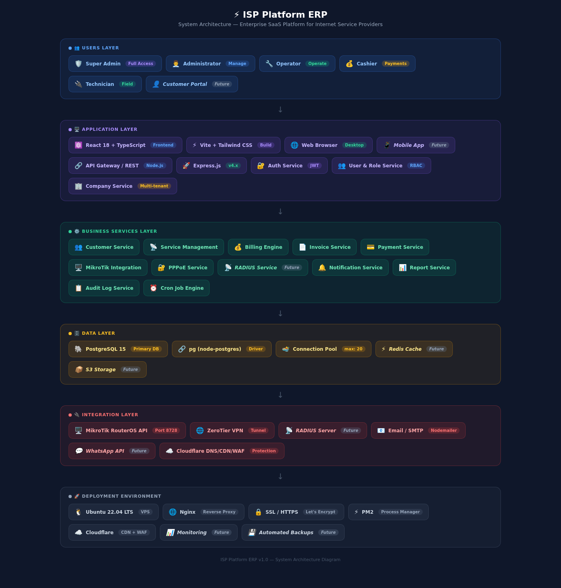
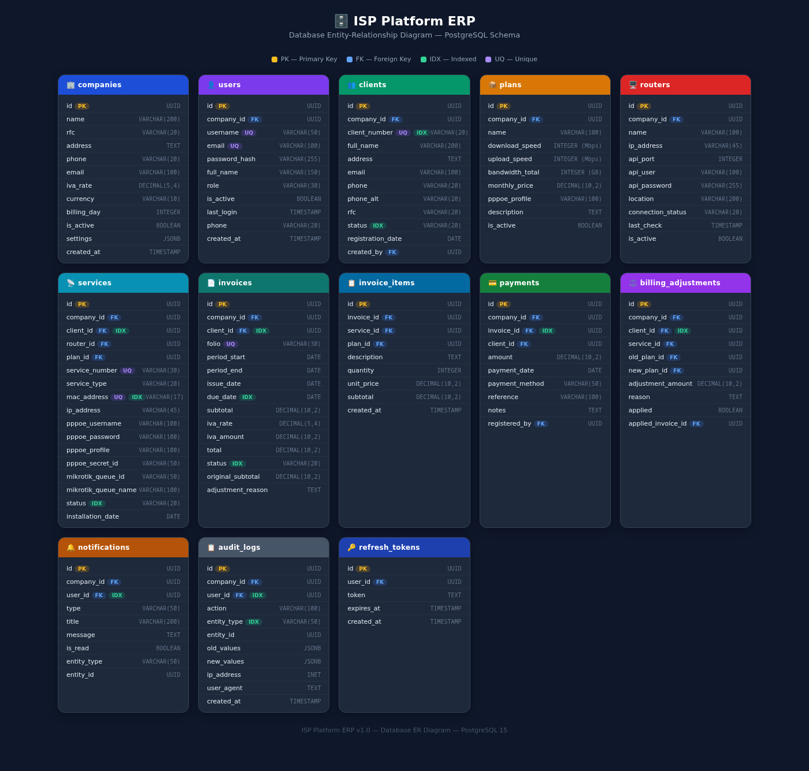
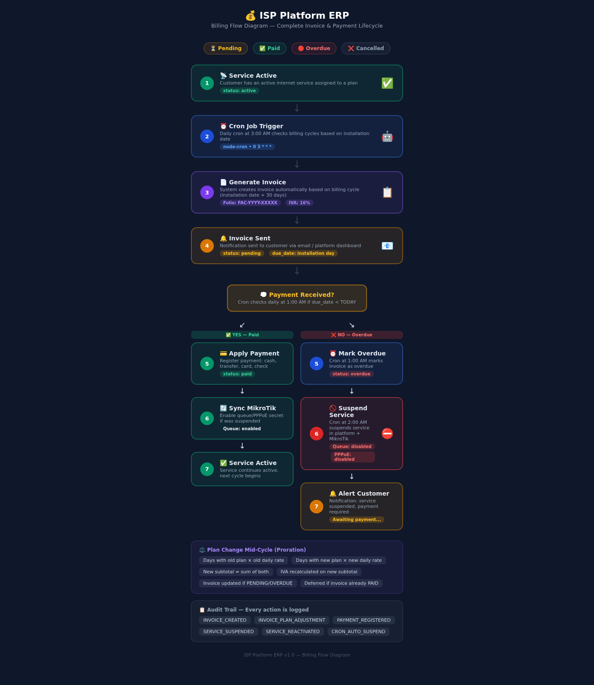
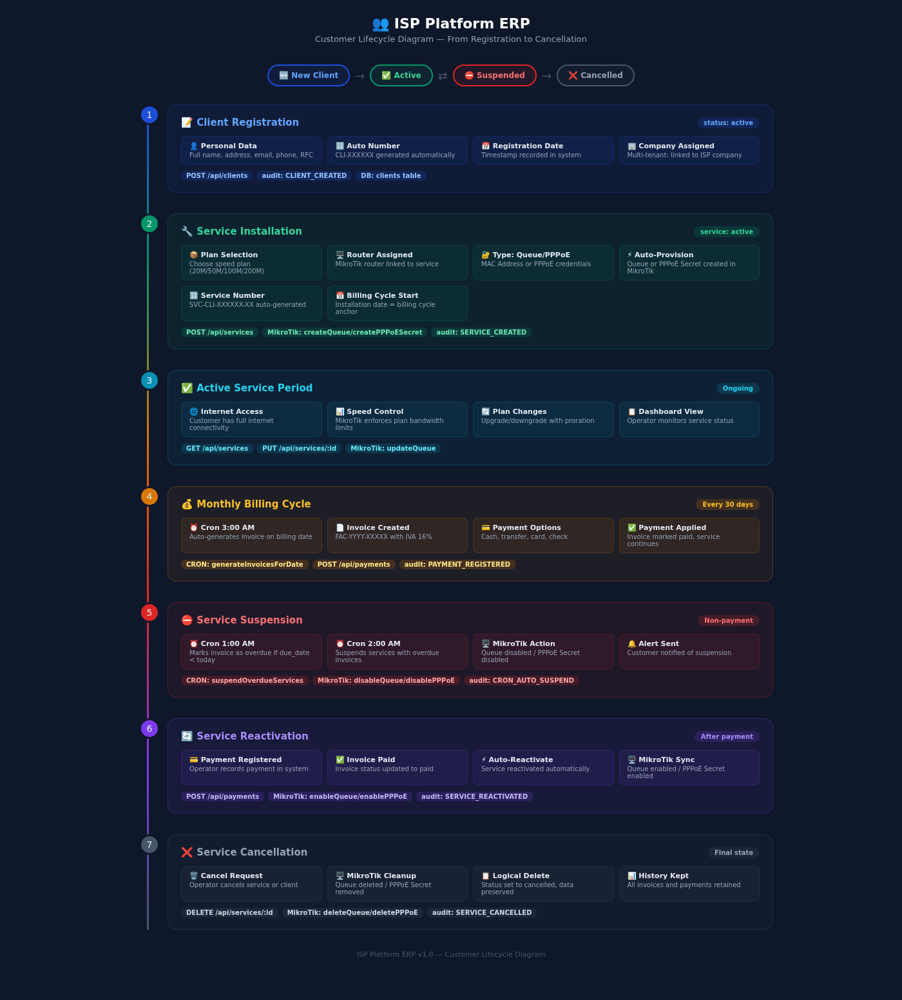
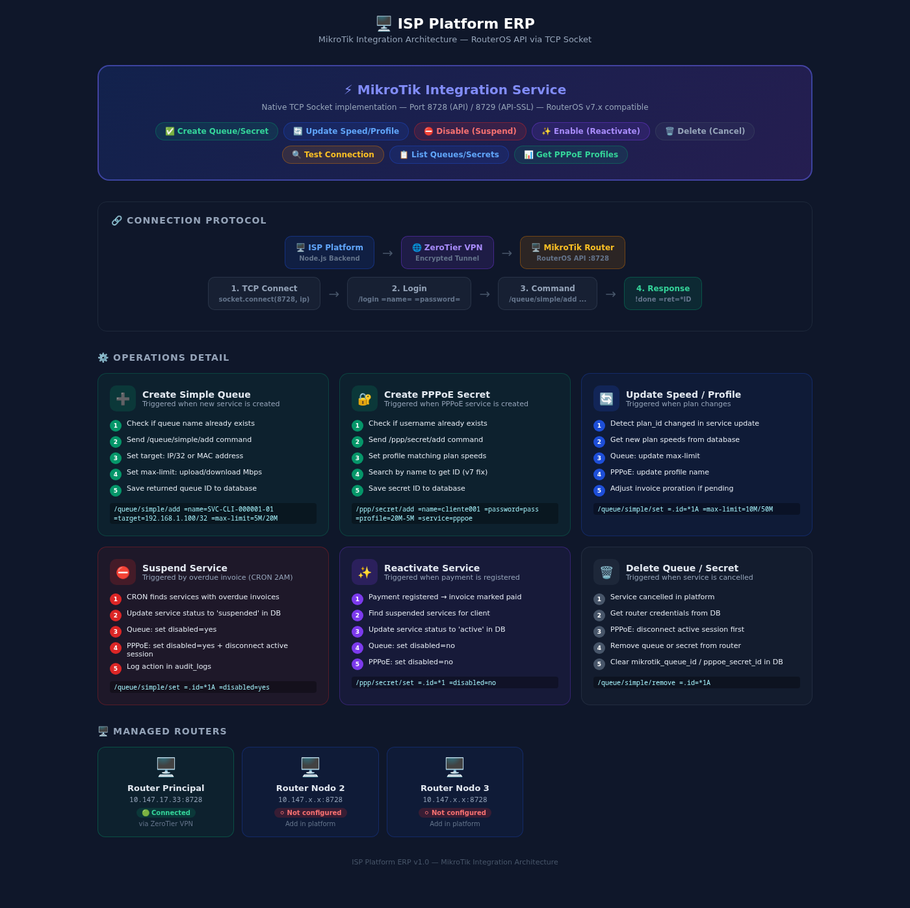
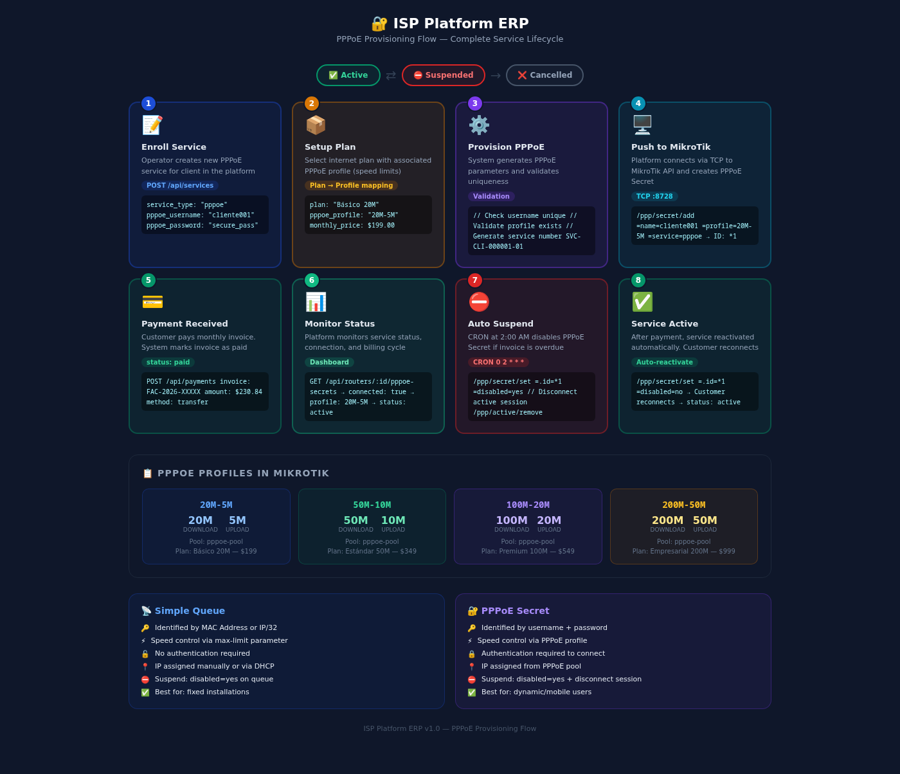
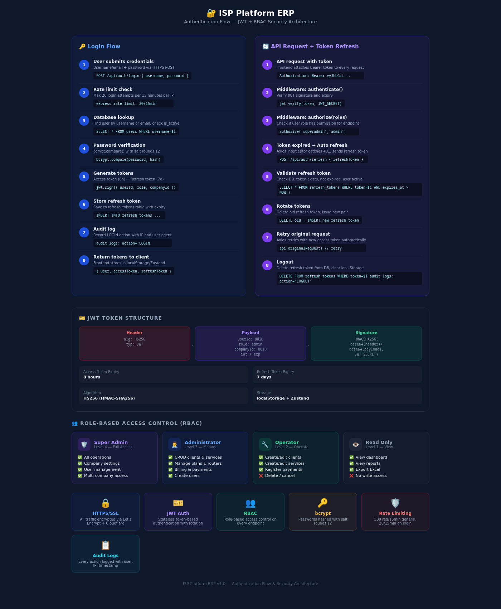
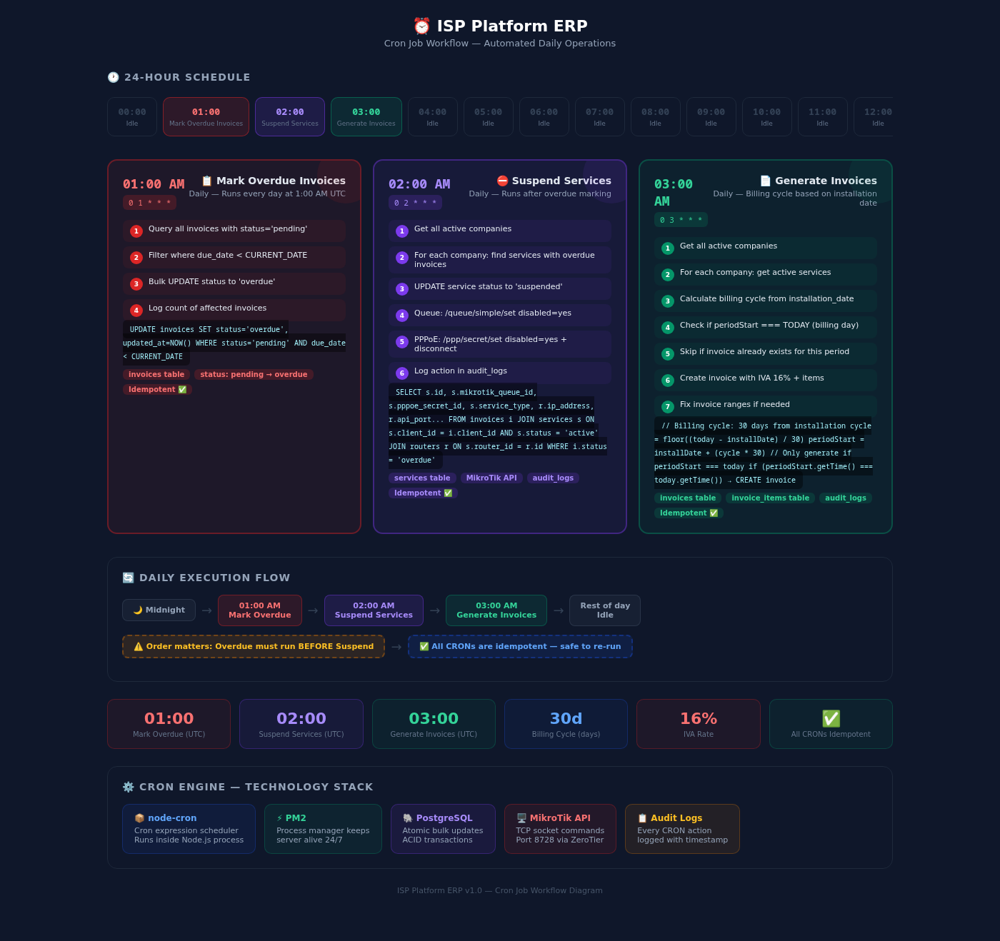

## 1️⃣ System Architecture

---

## 2️⃣ Database ER Diagram

---

## 3️⃣ Billing Flow

---

## 4️⃣ Customer Lifecycle

---

## 5️⃣ MikroTik Integration

---

## 6️⃣ PPPoE Provisioning

---

## 7️⃣ Authentication Flow

---

## 8️⃣ Cron Job Workflow

