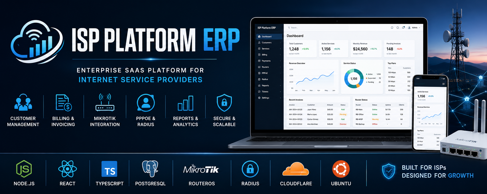

<p align="center">
  
</p>

<h1 align="center">🚀 ISP Platform ERP</h1>

<p align="center">
Enterprise Multi-Tenant SaaS Platform for Internet Service Providers
</p>

<p align="center">


</p>

---

# 📑 Table of Contents

- [📖 Overview](#-overview)
- [🎯 Business Goals](#-business-goals)
- [🌟 Key Features](#-key-features)
- [🏗 Solution Architecture](#-solution-architecture)
- [📚 Technical Documentation](#-technical-documentation)
- [📐 Engineering Diagrams](#-engineering-diagrams)
- [💻 Technology Stack](#-technology-stack)
- [🔒 Security](#-security)
- [🚀 Current Status](#-current-status)
- [👨‍💻 Lead Developer](#-lead-developer)

---

# 📖 Overview

ISP Platform ERP is an enterprise-grade multi-tenant SaaS platform developed to automate and centralize the daily operations of Internet Service Providers (ISPs).

The platform integrates billing, CRM, MikroTik RouterOS management, PPPoE provisioning, RADIUS authentication, customer management, reporting and financial administration into a single cloud-ready solution.

> **This repository contains documentation only.**
>
> Production source code is private and intentionally excluded.

---

# 🎯 Business Goals

- Automate ISP operations
- Centralize customer management
- Simplify billing and invoicing
- Integrate MikroTik RouterOS
- Manage PPPoE services
- Support multiple routers
- Generate operational reports
- Provide a scalable SaaS platform

---

# 🌟 Key Features

- Multi-Tenant SaaS
- Customer Management (CRM)
- Billing & Invoicing
- Payment Management
- MikroTik Router Integration
- PPPoE Synchronization
- RADIUS Authentication
- Service Suspension Automation
- REST API
- Audit Logs
- Role-Based Access Control (RBAC)
- Administrative Dashboard

---

# 🏗 Solution Architecture

```text
                        Internet
                            │
                     Cloudflare CDN
                            │
                  React + TypeScript
                            │
                     REST API (JWT)
                            │
                  Node.js + Express.js
                            │
                       PostgreSQL
            ┌──────────────┴──────────────┐
      MikroTik RouterOS            RADIUS Server
            │
      PPPoE Customers
```

---

# 📚 Technical Documentation

| Document | Description |
|-----------|-------------|
| 📐 Architecture | Overall platform architecture |
| 📦 Modules | Business modules |
| 🗄 Database | Entity relationship model |
| 🔌 REST API | API endpoints |
| 🔒 Security | Authentication & Authorization |
| 🚀 Deployment | Production deployment |
| 🛣 Roadmap | Future development |
| 📊 Diagrams | Technical architecture diagrams |

---

# 📐 Engineering Diagrams

The following diagrams describe the internal architecture and engineering design of ISP Platform ERP.

---

### 🏗 System Architecture

[](diagrams/01-system-architecture.png)

High-level platform architecture.

---

### 🗄 Database ER Diagram

[](diagrams/02-database-er-diagram.png)

Main entities and relationships.

---

### 💳 Billing Flow

[](diagrams/03-billing-flow.png)

Invoice generation and payment workflow.

---

### 👤 Customer Lifecycle

[](diagrams/04-customer-lifecycle.png)

Customer onboarding and service lifecycle.

---

### 🌐 MikroTik Integration

[](diagrams/05-mikrotik-integration.png)

Communication with MikroTik RouterOS.

---

### 🔌 PPPoE Provisioning

[](diagrams/06-pppoe-provisioning.png)

Automatic provisioning process.

---

### 🔐 Authentication Flow

[](diagrams/07-authentication-flow.png)

JWT Authentication and RBAC.

---

### ⏰ Cron Job Workflow

[](diagrams/08-cron-job-workflow.png)

Scheduled background services.

---
